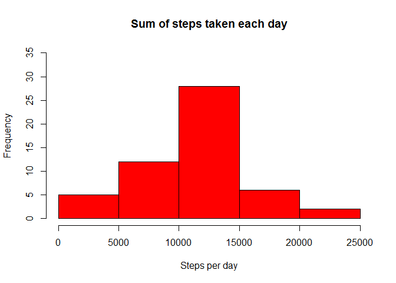
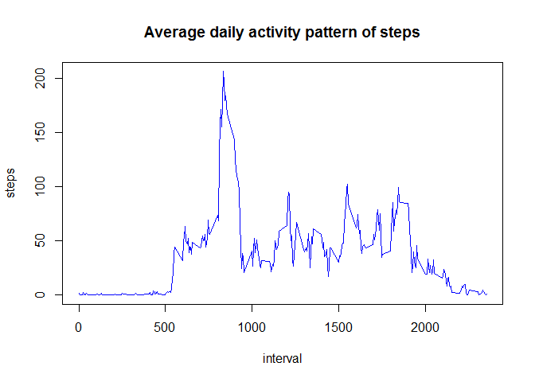
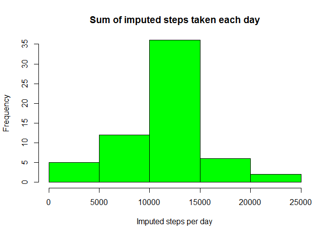
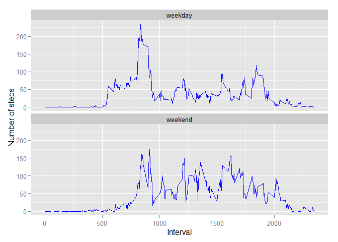

# Reproducible Research: Peer Assessment 1


## Loading and preprocessing the data

1. Load the data

```r
act<-read.csv("activity.csv")
 options(digits=2)
```
2. Process the data 


## What is mean total number of steps taken per day?

1. Calculate the total number of steps taken per day

```r
steps.sum<-with(act,tapply(steps,date,sum,na.rm=F))
steps.sum
```

```
## 2012-10-01 2012-10-02 2012-10-03 2012-10-04 2012-10-05 2012-10-06 
##         NA        126      11352      12116      13294      15420 
## 2012-10-07 2012-10-08 2012-10-09 2012-10-10 2012-10-11 2012-10-12 
##      11015         NA      12811       9900      10304      17382 
## 2012-10-13 2012-10-14 2012-10-15 2012-10-16 2012-10-17 2012-10-18 
##      12426      15098      10139      15084      13452      10056 
## 2012-10-19 2012-10-20 2012-10-21 2012-10-22 2012-10-23 2012-10-24 
##      11829      10395       8821      13460       8918       8355 
## 2012-10-25 2012-10-26 2012-10-27 2012-10-28 2012-10-29 2012-10-30 
##       2492       6778      10119      11458       5018       9819 
## 2012-10-31 2012-11-01 2012-11-02 2012-11-03 2012-11-04 2012-11-05 
##      15414         NA      10600      10571         NA      10439 
## 2012-11-06 2012-11-07 2012-11-08 2012-11-09 2012-11-10 2012-11-11 
##       8334      12883       3219         NA         NA      12608 
## 2012-11-12 2012-11-13 2012-11-14 2012-11-15 2012-11-16 2012-11-17 
##      10765       7336         NA         41       5441      14339 
## 2012-11-18 2012-11-19 2012-11-20 2012-11-21 2012-11-22 2012-11-23 
##      15110       8841       4472      12787      20427      21194 
## 2012-11-24 2012-11-25 2012-11-26 2012-11-27 2012-11-28 2012-11-29 
##      14478      11834      11162      13646      10183       7047 
## 2012-11-30 
##         NA
```

2. Make a histogram of the total number of steps taken each day

```r
hist(steps.sum,xlab="Steps per day", main="Sum of steps taken each day",col=2,ylim=c(0,35))
```

 

3.Calculate and report the mean and median of the total number of steps taken per day

```r
steps.sum.mean<-mean(steps.sum,na.rm=TRUE)
steps.sum.mean
```

```
## [1] 10766
```

```r
steps.sum.median<-median(steps.sum, na.rm=TRUE)
steps.sum.median
```

```
## [1] 10765
```

## What is the average daily activity pattern?

1. Make a time series plot (i.e. type = "l") of the 5-minute interval and the average number of steps taken, averaged across all days

```r
fa<-factor(act$interval)
steps.TS<-with(act,tapply(steps,fa,mean,na.rm=TRUE))
plot(levels(fa),steps.TS,type="l",xlab="interval",ylab="steps",main="Average daily activity pattern of steps",col="blue")
```

 

2. Which 5-minute interval, on average across all the days in the dataset, contains the maximum number of steps?

```r
max.TS.y<-max(steps.TS)
max.TS.x<-which(steps.TS == max.TS.y)
max.interval<-act$interval[max.TS.x]
```
 Maxmum number of steps was   206 at 835 time interval.
 
## Imputing missing values

1. Calculate and report the total number of missing values in the dataset (i.e. the total number of rows with NAs)

```r
sum(match(act$steps,NA),na.rm=TRUE)
```

```
## [1] 2304
```

2. Devise a strategy for filling in all of the missing values in the dataset.   

Mean value of 'steps' of every 5-minute interval (steps.TS) will fill NAs of 'steps' having the same interval value.

3. Create a new dataset that is equal to the original dataset but with the missing data filled in.

```r
new.steps<-act$steps
for(i in 1:length(act$steps)){
  if(is.na(act$steps[i])){
    new.steps[i]<-steps.TS[as.integer(unlist(dimnames(steps.TS)))==act$interval[i]]}
}
newna<-sum(match(new.steps,NA),na.rm=TRUE)
```
 Number of NA in new.steps is 0 .
 
4. Make a histogram of the total number of steps taken each day and Calculate and report the mean and median total number of steps taken per day. Do these values differ from the estimates from the first part of the assignment? What is the impact of imputing missing data on the estimates of the total daily number of steps?

```r
new.steps.sum<-tapply(new.steps,act$date,sum)
hist(new.steps.sum,xlab="Imputed steps per day", main="Sum of imputed steps taken each day",ylim=c(0,35),col="green")
```

 

```r
ho<-hist(steps.sum,plot=FALSE);ho$count[3]
```

```
## [1] 28
```

```r
hn<-hist(new.steps.sum,plot=FALSE);hn$count[3]
```

```
## [1] 36
```

Frequency between 10000 and 15000 is increased from  28 to 36.


```r
new.steps.sum.mean<-mean(new.steps.sum)
new.steps.sum.mean
```

```
## [1] 10766
```

```r
new.steps.sum.median<- median(new.steps.sum)
new.steps.sum.median
```

```
## [1] 10766
```

```r
steps.TS.mean<-mean(steps.TS)
steps.TS.median<-median(steps.TS)
```

All NAs in the mean of the total number of steps taken per day (steps.mean) were changed to the mean of the average number of steps taken along the 5-minute interval (step.TS.mean = 37.38).  
Also All NAs in the median of the total number of steps taken per day (steps.median) were changed to the median of the average number of steps taken along the 5-minute interval (step.TS.median = 34.11).  
This is because NA fills steps of all the interval of those days.   


```r
new.steps.sum<-tapply(new.steps,act$date,sum)
new.steps.sum
```

```
## 2012-10-01 2012-10-02 2012-10-03 2012-10-04 2012-10-05 2012-10-06 
##      10766        126      11352      12116      13294      15420 
## 2012-10-07 2012-10-08 2012-10-09 2012-10-10 2012-10-11 2012-10-12 
##      11015      10766      12811       9900      10304      17382 
## 2012-10-13 2012-10-14 2012-10-15 2012-10-16 2012-10-17 2012-10-18 
##      12426      15098      10139      15084      13452      10056 
## 2012-10-19 2012-10-20 2012-10-21 2012-10-22 2012-10-23 2012-10-24 
##      11829      10395       8821      13460       8918       8355 
## 2012-10-25 2012-10-26 2012-10-27 2012-10-28 2012-10-29 2012-10-30 
##       2492       6778      10119      11458       5018       9819 
## 2012-10-31 2012-11-01 2012-11-02 2012-11-03 2012-11-04 2012-11-05 
##      15414      10766      10600      10571      10766      10439 
## 2012-11-06 2012-11-07 2012-11-08 2012-11-09 2012-11-10 2012-11-11 
##       8334      12883       3219      10766      10766      12608 
## 2012-11-12 2012-11-13 2012-11-14 2012-11-15 2012-11-16 2012-11-17 
##      10765       7336      10766         41       5441      14339 
## 2012-11-18 2012-11-19 2012-11-20 2012-11-21 2012-11-22 2012-11-23 
##      15110       8841       4472      12787      20427      21194 
## 2012-11-24 2012-11-25 2012-11-26 2012-11-27 2012-11-28 2012-11-29 
##      14478      11834      11162      13646      10183       7047 
## 2012-11-30 
##      10766
```

```r
new.steps.sum-steps.sum
```

```
## 2012-10-01 2012-10-02 2012-10-03 2012-10-04 2012-10-05 2012-10-06 
##         NA          0          0          0          0          0 
## 2012-10-07 2012-10-08 2012-10-09 2012-10-10 2012-10-11 2012-10-12 
##          0         NA          0          0          0          0 
## 2012-10-13 2012-10-14 2012-10-15 2012-10-16 2012-10-17 2012-10-18 
##          0          0          0          0          0          0 
## 2012-10-19 2012-10-20 2012-10-21 2012-10-22 2012-10-23 2012-10-24 
##          0          0          0          0          0          0 
## 2012-10-25 2012-10-26 2012-10-27 2012-10-28 2012-10-29 2012-10-30 
##          0          0          0          0          0          0 
## 2012-10-31 2012-11-01 2012-11-02 2012-11-03 2012-11-04 2012-11-05 
##          0         NA          0          0         NA          0 
## 2012-11-06 2012-11-07 2012-11-08 2012-11-09 2012-11-10 2012-11-11 
##          0          0          0         NA         NA          0 
## 2012-11-12 2012-11-13 2012-11-14 2012-11-15 2012-11-16 2012-11-17 
##          0          0         NA          0          0          0 
## 2012-11-18 2012-11-19 2012-11-20 2012-11-21 2012-11-22 2012-11-23 
##          0          0          0          0          0          0 
## 2012-11-24 2012-11-25 2012-11-26 2012-11-27 2012-11-28 2012-11-29 
##          0          0          0          0          0          0 
## 2012-11-30 
##         NA
```

Sum of imputed steps of those days estimated 10766 which was not available (NA) previously.  
Obviously 10766 equals to sum of the average daily activity.

## Are there differences in activity patterns between weekdays and weekends?

1. Create a new factor variable in the dataset with two levels - "weekday" and "weekend" indicating whether a given date is a weekday or weekend day.


```r
fu<-Sys.setlocale("LC_TIME","us")
week<-rep("weekday",length(act$date))
week[(weekdays(as.Date(act$date,"%Y-%m-%d")) %in% c("Sunday" ,"Saturday"))]<-"weekend" 
week<-factor(week)
act2<-cbind(act,week)
str(act2)
```

```
## 'data.frame':	17568 obs. of  4 variables:
##  $ steps   : int  NA NA NA NA NA NA NA NA NA NA ...
##  $ date    : Factor w/ 61 levels "2012-10-01","2012-10-02",..: 1 1 1 1 1 1 1 1 1 1 ...
##  $ interval: int  0 5 10 15 20 25 30 35 40 45 ...
##  $ week    : Factor w/ 2 levels "weekday","weekend": 1 1 1 1 1 1 1 1 1 1 ...
```

2. Make a panel plot containing a time series plot (i.e. type = "l") of the 5-minute interval (x-axis) and the average number of steps taken, averaged across all weekday days or weekend days (y-axis). 


```r
fad<-factor(act2[week=="weekday",]$interval)
steps.TS.wd<-tapply(act2[week=="weekday",]$steps,fad,mean,na.rm=TRUE)
fan<-factor(act2[week=="weekend",]$interval)
steps.TS.wn<-tapply(act2[week=="weekend",]$steps,fan,mean,na.rm=TRUE)
act3<-data.frame(Interval=as.numeric(c(levels(fad),levels(fan))),
                 steps=c(steps.TS.wd,steps.TS.wn),
                 week=c(rep("weekday",length(steps.TS.wd)),rep("weekend",length(steps.TS.wn)))
                 )
library("ggplot2")
ggplot(data=act3, aes(x=Interval, y=steps))+
        geom_line(color="blue") +
        facet_wrap(~ week, nrow=2, ncol=1)+
        labs(y="Number of steps")
```

 
